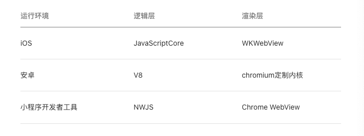

### 小程序由来
微信为 webview 提供的 js-sdk 逐渐被广为流传，加上复杂页面加载会有白屏问题和影响 web 体验的问题：页面切换的生硬和点击的迟滞感。 二者结合之下就诞生了小程序的概念；

小程序的优点：
- 快速加载
- 功能强大
- 原生app体验
- 微信数据开放
- 高效和简单的开发

### 与普通网页区别
1. 普通网页的渲染线程和脚本线程（主线程内部职责划分）互斥，而小程序是相互分开独立的，逻辑层运行在 JSCore 中，缺少相关的 DOM API 和 BOM API。渲染层和逻辑层通过原生应用进行交互，请求也由原生应用进行转发
2. 普通网页需要对不同浏览器兼容，而小程序需要对不同的操作系统兼容，
3. 使用自己的 js 引擎，提供一套特定的 API 和组件库，即不是按照 web 标准实现。

### 代码构成
- json 配置-小程序配置 app.json、开发者工具配置 project.config.json、 页面配置 page.json
- WXML 使用封装好的标签 view、text、button 等， 提供 wx: if 、事件绑定等属性和 {{}} 表达式， 通过管理状态来更新界面
- wxss 新增尺寸单位 rpx， 小程序底层会自动换算，开发者无需考虑手机设备的像素比； 只支持部分选择器，class、id、tag、::after、::before
- js  不支持动态执行 js，通过 Page/Component 构造器注册页面，指定页面的初始数据、生命周期回调、事件处理函数等。

### 部署
将代码通过开发者工具上传到平台，指定开发、体验和线上版本

### 目录结构
小程序包含一个描述整体程序的 app 和多个 page

小程序主体由 app.js、app.json、app.wxss 三个文件组成，必须放置在根目录下

页面由四个文件组成：js、wxml、json、wxss ，必须具有相同路径与文件名

只有特定格式的图片、音视频等文件允许上传

### 生命周期
Page 实例的生命周期：
1. onload
2. onShow 之后开始首屏渲染
3. onReady  此时已经渲染完毕，进入激活状态
4. (onHide -> onShow)
5. onUnload

app 实例的生命周期：

冷启动 -> 切换到后台 5 秒后挂起 -> 挂起 30 分钟后销毁

### Skyline 渲染引擎
对 webview 进行优化。

对 Appservice 和 webview 的分离方式进行优化和调整，无需为每个页面创建单独的 webView ，由于询问页面信息等接口为异步，推出新的 Worklet 机制，用以高性能地构建各种复杂的动画效果。

可以与 webview 混合使用
