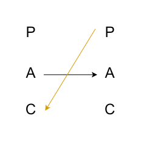
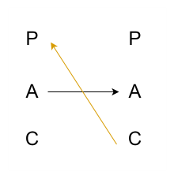

Parent：模仿父母或类父母行为，主要为养育型和控制型

Adult：根据当下事实自我反应、头脑清醒

Child：婴孩时状态，受批评时生气，受表扬时开心，充满好奇，脆弱、胆小、冲动，容易被影响，拼尽全力受大人喜欢，主要分为反叛型和顺从型

根据自身发出状态，期待回应状态，对应实际回应状态和对象期待回应状态共可分为 81 中沟通模式

### 最常见的两种错误沟通模式
1. AA -> PC

以成人状态发出，期待成人状态，对象以父母状态回应，诱导儿童状态归顺

2. AA -> CP

以成人状态发出，期待成人状态，对象以儿童状态回应，激发父母状态安慰

**注意：在一段对话中，沟通状态并不是单一的，持续的，而有可能包含多种状态且随时切换的**

### 如何更好的沟通
学会在关键对话中切断下意识的反应，至少想象不同，至少想象三个不同自我状态下的自己会怎么做

不要机械的迎合大脑激发的情绪，不要臣服于对象引诱你做出的反应，冷静引导对方到新的和自己互补的自我状态中，如果对方没有改变就再换一种状态去应对，直到自己感到舒服为止

### 最后
成熟的标志是能够自由的选择自我状态和这个世界相处，而不是让自己跟父母状态和儿童状态隔离