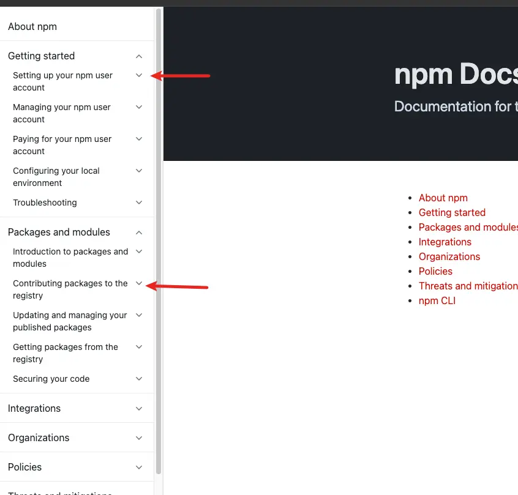
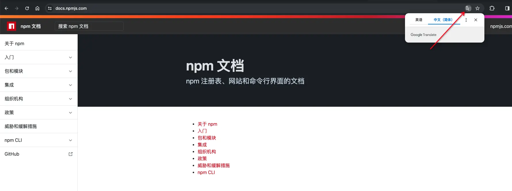

发布代码到 NPM 上分为 4 个步骤：

1. 注册 NPM 账号： [https://www.npmjs.com/signup](https://www.npmjs.com/signup)
2. 在项目文件夹下运行`npm init` 初始化项目（已有项目跳过这步）
3. 运行 `npm adduser` 输入账户密码登录
4. 登录完后，运行 `npm publish` 发布代码，结束！ so easy 

发布后， 直接在 npm 官网搜包名就出来了， 或者通过 `npm info <package name>` 也能查看是否发布成功。

注意一：package.json 中的 name 字段就是你发布到 npm 中的包名，这个名称不能和已有包名重复或类似

注意二：在发布过程中应当使用官方源，而不是镜像源（淘宝、阿里云等），没改过下载源请忽略；且代码发布到官方源上之后，镜像源可能需要等几分钟后才有(毕竟是从官方那拷贝过来的)

具体流程在官方文档上写的非常详细：[https://docs.npmjs.com/](https://docs.npmjs.com/)

如果看不懂英文也没关系，使用 chrome 浏览器直接一键转中文：

