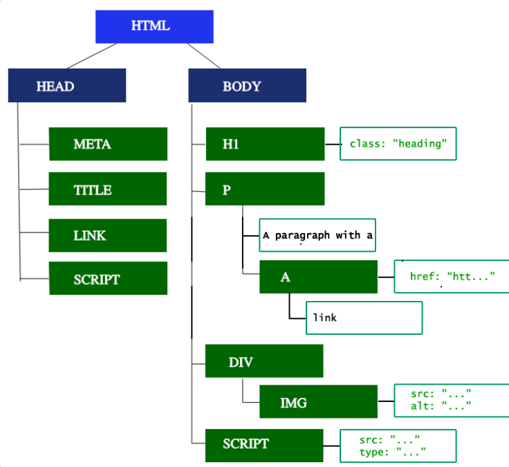

在获取到 html 文档之后，浏览器开始渲染页面...

浏览器页面的渲染过程分为五个步骤： 构建 DOM 树、构建 CSSOM 树、构建 render 树、布局和绘制。

## 构建 DOM 树
该步骤是对 html 标签的处理，通过树结构中的父节点、子节点和兄弟节点来表示元素的嵌套关系

在处理过程中，遇到需要资源文件，如图片等，浏览器会发起请求然后继续解析，

但如果遇到没有 async/defer 属性的 script 标签时，解析器会停下来，开始解析执行脚本，执行完毕后才继续处理剩余的标签（因为 javascript 可能会改变 dom 结构）。

### 预加载扫描器
在构建 dom 树的过程中，主线程被占用，浏览器会单独开一个预加载线程用于请求高优先级资源，如 CSS、JavaScript 和 web 字体等， 以此来减少阻塞。

## 构建 CSSOM 树
该步骤是对样式规则的处理，与构建 dom 树类似，通过树结构表示基于 CSS 选择器的规则嵌套关系

CSSOM 树中也包含了用户代理(即浏览器默认设置)的样式表，浏览器从最低优先级规则开始应用直到最高优先级，最后得出一个节点的级联规则，

## 生成 render 树
构建完 CSSOM 树之后，浏览器根据 DOM 树和 CSSOM 树生成渲染树

在这个过程中，某些不可见的元素将被过滤掉，如 `<head>` 元素、display 为 none 的元素等，但 visibility 为 hidden 的元素会出现渲染树中，因为其仍占用布局空间

## 布局
构建完 render 树之后就开始布局，该过程以视口的大小为基础，从 body 元素开始计算其与其后代的盒模型大小和在页面上的位置

对于还不知道尺寸大小的元素使用占位符代替，如图像元素

除了第一次运算过程称之为布局，后续的运算过程都称之为回流

任何会导致页面的部分内容或整个文档的大小和位置发生变化的操作都会导致回流

## 绘制
确定完各个盒子大小和位置后，最后一步就是将内容转换为像素呈现在屏幕上

除了首次绘制，后续的运算过程称为重绘

为了使得重绘的速度更快，浏览器会对内容分层绘制，而后再合成显示

某些层的内容由 GPU 而不是 cpu 进行绘制，这样速度更快

某些特殊属性和元素会进行单独分层绘制，如 `<video>、<canvas>` 元素和任何 opacity 、三维 transform 和 will-change 属性不为默认值的元素等

单独分层可以提高绘制速度，但若过度分层会带来内存管理消耗，因此不要过度使用

至此浏览器的渲染过程完毕，接下来进入 javascript 解析执行或直接允许进行内容交互...

## 参考
[Populating the page: how browsers work](https://developer.mozilla.org/en-US/docs/Web/Performance/How_browsers_work)

